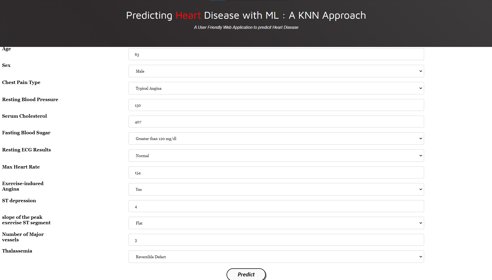
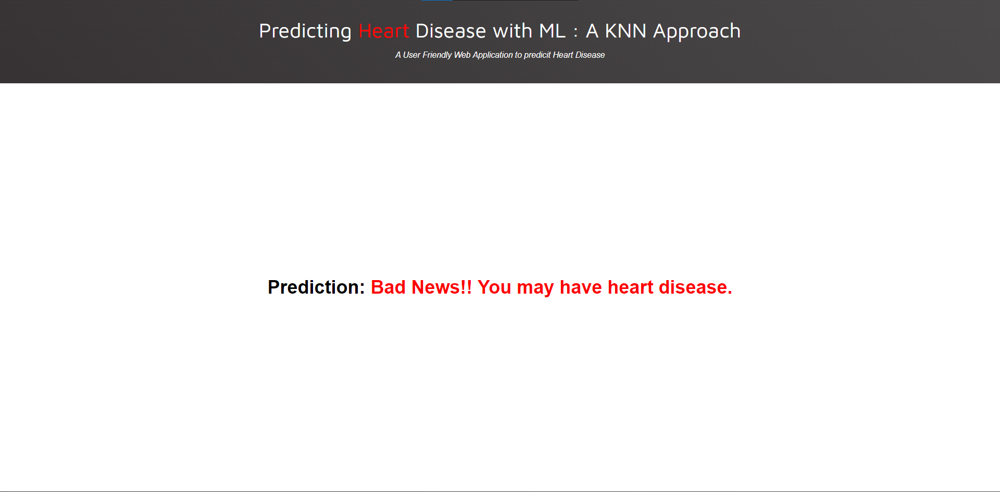

# HEART WISE

## Heart Disease Prediction

This project aims to predict the presence of heart disease in patients based on various factors using a machine learning model. The dataset used in this project contains information about patients, including their age, sex, chest pain type, blood pressure, cholesterol level, fasting blood sugar, electrocardiography results, exercise-induced angina, ST depression, slope of peak exercise ST segment, number of major vessels, and thalassemia. The target variable is the presence or absence of heart disease.

## Project Structure

The project consists of the following files:

- `model.py`: Contains the code for training a K-nearest neighbors (KNN) classifier on the heart disease dataset.
- `app.py`: Implements a Flask application to create a web interface for predicting heart disease using the trained model.
- `accuracy.py`: Calculates and prints the accuracy of the KNN classifier for different values of `n_neighbors`.
- `Prediction.py`: Demonstrates how to use the trained model for predicting heart disease for specific input values.
- `templates/main.html`: HTML template for the main page of the web application.
- `templates/result.html`: HTML template for displaying the prediction result.
- `static/style.css`: CSS file for styling the web application.
- `heart.csv`: The heart disease dataset in CSV format.
- `requirements.txt`:List of all required files to run the project.
- `README.md`: This file.

## Usage

1. Install the necessary dependencies by running `pip install -r requirements.txt`.
2. Train the model by running `python model.py`. This will generate a file named `model.pkl`.
3. Start the Flask application by running `python app.py`.
4. Access the web interface by visiting `http://localhost:5000` in your browser.
5. Enter the required information and click the "`Predict`" button to get the prediction result.

## Screenshots

### Main Page

### Result Page

## Contributors

Feel free to contribute by submitting bug reports, feature requests, or pull requests on [GitHub](https://github.com/Raviruler/HeartWise).

## License

This project is licensed under the [MIT License](https://opensource.org/licenses/MIT).